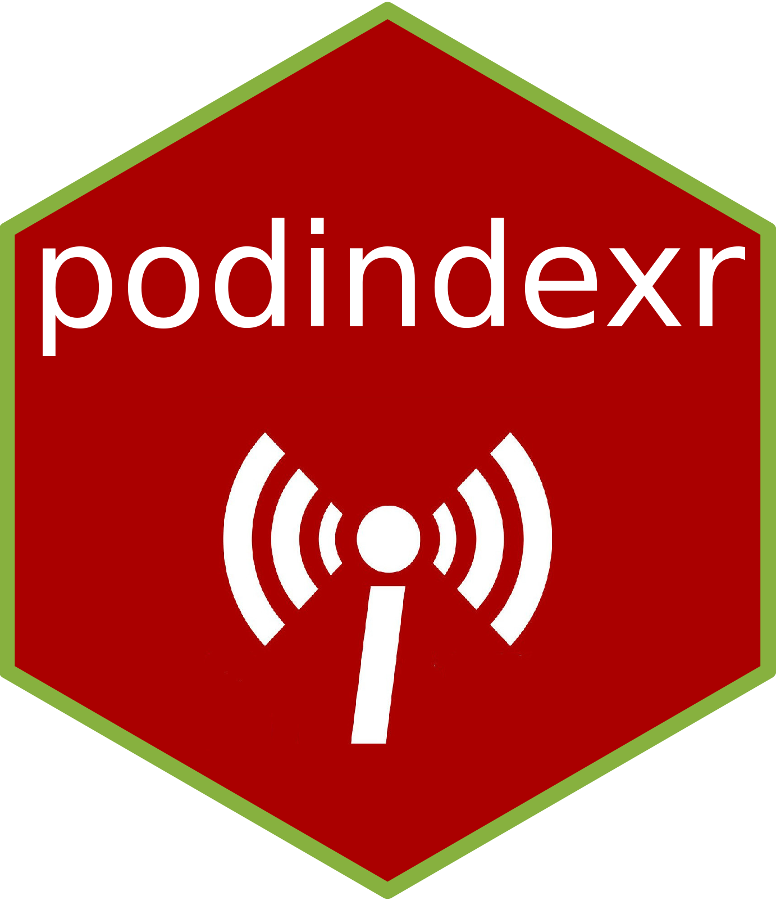

<!-- README.md is generated from README.Rmd. Please edit that file -->

# podindexr 

<!-- badges: start -->
<!-- badges: end -->

`podindexr` is an R package providing a tidy interface to the [Podcast
Index](https://podcastindex.org) database API available at
<https://podcastindex-org.github.io/docs-api>.

> The Podcast Index is here to preserve, protect and extend the open,
> independent podcasting ecosystem. We do this by enabling developers to
> have access to an open, categorized index that will always be
> available for free, for any use.

## Installation

You can install the development version of podindexr from
[GitHub](https://github.com/) with:

``` r
# install.packages("devtools")
devtools::install_github("rpodcast/podindexr")
```

## Configuration

The majority of the API endpoints supported by `podindexr` require an
API key and secret pair. To obtain your own set, create a free developer
account at <https://api.podcastindex.org> and save the credentials as
environment variables called `PODCASTINDEX_API_KEY` and
`PODCASTINDEX_API_SECRET` within a project-level or default
user-directory `.Renviron` file.

## Usage

For a comprehensive overview of the package functionality, visit the
documentation site (LINK TBD). Below are examples of obtaining metadata
associated with the [RWeekly Highlights](https://rweekly.org) podcast:

### Search

``` r
library(podindexr)
search_bytitle("R Weekly Highlights")
#> # A tibble: 1 × 29
#>        id title url   origi…¹ link  descr…² author owner…³ image artwork lastU…⁴
#>     <int> <chr> <chr> <chr>   <chr> <chr>   <chr>  <chr>   <chr> <chr>     <int>
#> 1 1062040 R We… http… https:… http… The R … Eric … Eric N… http… https:…  1.67e9
#> # … with 18 more variables: lastCrawlTime <int>, lastParseTime <int>,
#> #   lastGoodHttpStatusTime <int>, lastHttpStatus <int>, contentType <chr>,
#> #   itunesId <int>, generator <chr>, language <chr>, type <int>, dead <int>,
#> #   crawlErrors <int>, parseErrors <int>, categories <named list>,
#> #   locked <int>, explicit <lgl>, podcastGuid <chr>, episodeCount <int>,
#> #   imageUrlHash <dbl>, and abbreviated variable names ¹​originalUrl,
#> #   ²​description, ³​ownerName, ⁴​lastUpdateTime
```

### Episodes

``` r
episodes_byfeedid(1062040)
#> # A tibble: 10 × 25
#>             id title link  descr…¹ guid  dateP…² dateP…³ dateC…⁴ enclo…⁵ enclo…⁶
#>          <dbl> <chr> <chr> <chr>   <chr>   <int> <chr>     <int> <chr>   <chr>  
#>  1 11884295562 Issu… http… "<p>Bi… d488…  1.67e9 Decemb…  1.67e9 https:… audio/…
#>  2 11730994228 Issu… http… "<p>A … c561…  1.67e9 Decemb…  1.67e9 https:… audio/…
#>  3 11563142312 Issu… http… "<p>Re… 0368…  1.67e9 Novemb…  1.67e9 https:… audio/…
#>  4 11411022462 Issu… http… "<p>A … 8285…  1.67e9 Novemb…  1.67e9 https:… audio/…
#>  5 11175887029 Issu… http… "<p>Em… 8453…  1.67e9 Novemb…  1.67e9 https:… audio/…
#>  6 10845255282 Issu… http… "<p>Th… 647b…  1.67e9 Octobe…  1.67e9 https:… audio/…
#>  7 10708808246 Issu… http… "<p>Th… 7a92…  1.67e9 Octobe…  1.67e9 https:… audio/…
#>  8 10577711785 Issu… http… "<p>De… 30d5…  1.66e9 Octobe…  1.67e9 https:… audio/…
#>  9 10429057844 Issu… http… "<p>A … 4fa6…  1.66e9 Septem…  1.67e9 https:… audio/…
#> 10 10282640257 Issu… http… "<p>A … 56f6…  1.66e9 Septem…  1.67e9 https:… audio/…
#> # … with 15 more variables: enclosureLength <int>, duration <int>,
#> #   explicit <int>, episodeType <chr>, season <int>, image <chr>,
#> #   feedItunesId <int>, feedImage <chr>, feedId <int>, feedLanguage <chr>,
#> #   feedDead <int>, chaptersUrl <chr>, transcriptUrl <chr>, persons <list>,
#> #   transcripts <list>, and abbreviated variable names ¹​description,
#> #   ²​datePublished, ³​datePublishedPretty, ⁴​dateCrawled, ⁵​enclosureUrl,
#> #   ⁶​enclosureType
```
